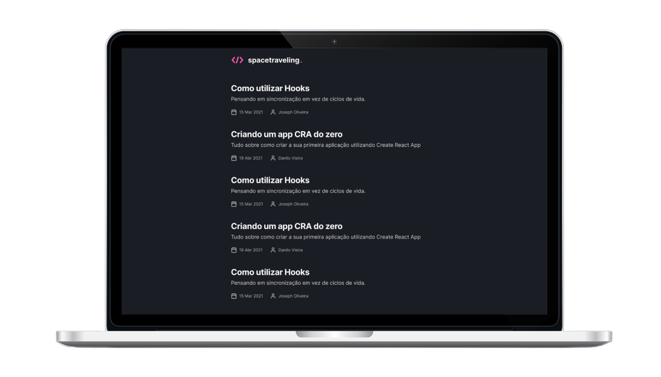

<p align="center">
  
</p>

<p align="center">
  

  

  
</p>

<div align="center">
  
</div>

<br>

## 💡 Introduction

JAMStack Blog web application using NextJS

- View a list of all posts
- View a complete post

<br>

## 🧪 Technologies and Services

- [React](https://reactjs.org)
- [NextJS](https://nextjs.org/)
- [Prismic CMS](https://prismic.io/)

<br>

## 🖥 Pre-requisites:

- NodeJS
- Yarn

<br/>

## 🚀 How to Run it?

From project's root file:

```sh
$ yarn install
$ yarn dev
```

<br/>

## ⚙️ Environment Variables

Here are an example of how you can set up your `.env.local` file with Services Variables. Replace them with your own services values.

```js
PRISMIC_API_ENDPOINT = 'prismic_api_endpoint';
```

<br>

## 🔖 Layout

Check Figma Layout of this project [here](<https://www.figma.com/file/o0gsySitrtCIpzhRpKLoYp/Desafios-M%C3%B3dulo-3-ReactJS-(Copy)?node-id=0%3A1>)

<br>

## 📝 License

MIT License © Yuri Paiva. Check [LICENSE](LICENSE) for more details

---

<br>

Made with 💜 &nbsp;by Yuri Paiva
